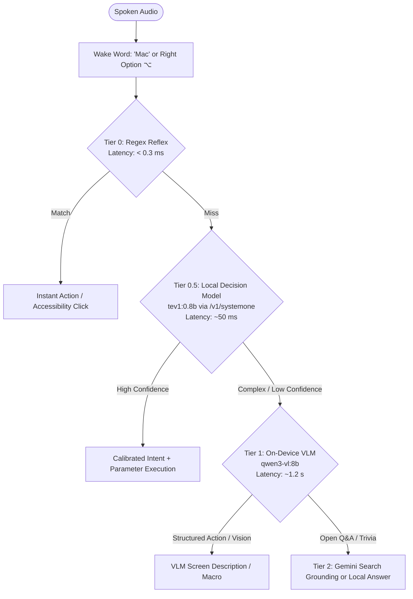

# 🎙️ Free Mac Voice Control

**Fast, private, 100% on-device voice control for macOS.**  
**$0 per command, forever.** No cloud subscriptions, no API keys required, no telemetry — every syllable is transcribed and executed locally on Apple Silicon.

[](https://apple.com)
[](https://developer.apple.com/metal/)
[-brightgreen.svg)](tests/)
[](#privacy--local-by-default)
[](LICENSE)

---

## ⚡ The Experience

Hold **Right Option ⌥**, speak, release. Or simply talk hands-free using the wake word **"Mac"**:

> *"Mac, open notes and snap left"*  
> *"Mac, turn the TV volume down by 5"*  
> *"Mac, click the Reply button"*  
> *"Mac, what's on my screen?"*

---

## 🚀 One-Command Install

```bash
git clone https://github.com/bparlette/free-mac-voice.git
cd free-mac-voice

# Standard interactive setup:
bash install.sh

# Or 100% unattended / zero-touch setup (accepts defaults & enables login service):
bash install.sh --yes
```

The installer configures everything automatically: Homebrew packages, `whisper.cpp` with Metal acceleration, Python virtual environment, local AI decision and vision models, and opens a visual 60-second start guide (`welcome.html`).

---

## 🧠 The 4-Tier Architecture

Three faster tiers run before any generative model is called. Slower tiers only engage when faster tiers cannot resolve your request:



1. **Tier 0 — The Reflex (<0.3 ms):** Exact pattern matching on compiled regex tables with fuzzy app resolution and conversational filler stripping. Standard commands fire in microseconds. Real UI clicks route through `xa11y` with an Apple Vision OCR fast-path (**~60 ms**).
2. **Tier 0.5 — Local Decision Model (~50 ms):** Powered by Ollama 0.35's Jev-style System One API (`tev1:0.8b`). Evaluates conversational commands (*"could you turn down the sound"*, *"be a dear and open my browser"*) in a single forward pass with calibrated probabilities ($p > 0.85$), eliminating token-by-token decoding delays.
3. **Tier 1 — On-Device Vision-Language Model (~1.2 s):** Local `qwen3-vl:8b` handles visual screen understanding (*"what's on my screen"*, *"read my screen to me"*) and complex multi-entity phrasing. 100% private, offline, and resident in unified memory.
4. **Tier 2 — The Answerer (Optional):** Google's free Gemini API answers general trivia or open-ended web questions with live Google Search grounding. If offline or quota-limited, it falls back to the local model.

---

## 🗣️ Spoken Commands Reference

### 🚀 Apps, Windows & Spaces
| Voice Command | Action |
|---|---|
| `“open notes”` / `“open my code”` | Opens or focuses app (fuzzy matched to installed apps) |
| `“switch to safari”` / `“focus chrome”` | Prioritizes already-running applications |
| `“open notes and snap left”` | Chained command: opens app and tiles it left |
| `“snap left”` / `“snap right”` / `“maximize”` | Instant window layout and screen tiling |
| `“center window”` / `“minimize”` / `“close”` | Active window management |
| `“next space”` / `“prev space”` | Switches macOS virtual desktops (Spaces) |
| `“move to next display”` | Moves focused window to adjacent monitor |
| `“new tab”` / `“close tab”` / `“reopen tab”` | Browser / terminal tab management |
| `“show all windows”` / `“show desktop”` | Mission Control (F3) and Reveal Desktop (F11) |
| `“quit spotify”` / `“close all windows”` | Clean application shutdown (confirms aloud first) |

### 🍿 Apple TV & Couch Media Experience
| Voice Command | Action |
|---|---|
| `“watch youtube”` / `“open netflix”` | Launches streaming services directly in the browser |
| `“watch disney plus”` / `“open hulu”` / `“open max”` / `“watch prime video”` | Direct-to-app streaming launcher |
| `“watch apple tv”` | Opens native macOS Apple TV app (`/System/Applications/TV.app`) |
| `“search youtube for lofi hip hop”` | Direct search query on YouTube |
| `“skip 10 seconds”` / `“fast forward 30 seconds”` | Jumps forward across YouTube, Netflix, Disney+, VLC |
| `“rewind”` / `“go back 15 seconds”` | Jumps backward across video players |
| `“what did they say?”` | Rewinds 15s and toggles subtitles (signature Apple TV feature) |
| `“subtitles on”` / `“toggle subtitles”` | Toggles closed captions (`c` key standard across web players) |
| `“next episode”` | Plays next video or episode (`Shift+N`) |
| `“fullscreen”` / `“theater mode”` | Toggles macOS full screen (`Ctrl+Cmd+F`) |
| `“airplay”` / `“screen mirroring”` | Opens AirPlay Receiver settings to cast from iPhone or iPad |

### 🗣️ Voice Auditions & High-Definition Speech
*Powered by Kokoro-82M (default neural TTS engine) with instant offline `say` fallback.*
| Voice Command | Action |
|---|---|
| `“pick a voice”` / `“sample voices”` | Rotates through curated voices speaking: `"[Name]. This is what I sound like on your Mac."` |
| `“use voice Adam”` / `“set voice to Heart”` | Selects active voice (saved permanently to `~/.config/free-voice/config.json`) |
| `“switch voice to George”` / `“use voice Sarah”` | Switches persona and confirms in that exact voice |
| `“what is my voice?”` | Reports the currently active voice and TTS engine |

### 🔊 Sound, System & Media
| Voice Command | Action |
|---|---|
| `“set volume to 30”` / `“volume up”` / `“mute”` | System volume control |
| `“play”` / `“pause”` / `“next”` / `“previous”` | macOS media playback keys (Apple Music, Spotify, YouTube) |
| `“play some jazz”` | Launches matching playlist in Apple Music |
| `“dim screen”` / `“brightness up”` | Display brightness controls |
| `“turn wifi off”` / `“turn wifi on”` | Network controls |
| `“dark mode”` / `“light mode”` | Toggles macOS appearance |
| `“lock”` / `“lock it down”` | Instant screen lock |
| `“set a timer for 10 minutes”` | Background countdown, announces aloud on completion |
| `“are you working”` / `“status”` | Spoken health check: active mic, models, and errors |

### 📺 Samsung Smart TV Control (Over Wi-Fi)
*Requires one-time SmartThings token setup (see below).*
| Voice Command | Action |
|---|---|
| `“switch to computer”` / `“switch to tv”` | Switches TV input directly to your Mac or TV mode |
| `“switch input to HDMI 2”` | Switches TV to any named source |
| `“turn on the tv”` / `“turn off the tv”` | Powers the Samsung TV on or off |
| `“set tv volume to 25”` | Sets TV volume to exact level (0–100) |
| `“tv volume up”` / `“tv volume down by 5”` | Steps TV volume |
| `“mute tv”` / `“unmute tv”` | Mutes or unmutes Samsung TV audio |
| `“pause tv”` / `“play tv”` / `“stop tv”` | Controls Samsung TV media streaming playback |

### 👁️ Screen Vision & Smart Clicks
| Voice Command | Action |
|---|---|
| `“click the Reply button”` | Semantic click via Accessibility tree (`xa11y`) |
| `“click the blue Download link”` | High-speed Apple Vision OCR fast-path (**~60 ms**) |
| `“click”` | Clicks at current mouse coordinates |
| `“move mouse up 200”` / `“scroll down 3”` | Cursor positioning and smooth scrolling |
| `“what's on my screen”` | Quartz summary (~1.3 ms) or on-device VLM scene analysis |
| `“read my screen to me”` | Top-to-bottom window text readout |
| `“screenshot”` / `“record screen”` | Native macOS capture shortcuts |

### 🛠️ Dictation, Tools & Custom Shortcuts
| Voice Command | Action |
|---|---|
| `“when I say party mode, set volume to 80 and play some jazz”` | Teaches a new multi-command shortcut |
| `“when I say bedtime, turn off the tv and sleep”` | Teaches custom bedtime sequence |
| `“alias surf to open safari”` | Teaches new custom trigger words |
| `“when I say backup, run bash ~/backup.sh”` | Runs custom local shell scripts via voice |
| `“what are my shortcuts”` / `“list shortcuts”` | Reads your active custom shortcuts aloud |
| `“forget shortcut party mode”` | Deletes a custom shortcut |
| `“start dictating”` | Continuous dictation until you say `“stop dictating”` |
| `“read clipboard”` | Reads your copied clipboard text aloud |
| `“type today's date”` / `“type the time”` | Types formatted date/time stamp |
| `“turn my screen into ascii art”` | Converts screenshot to dark-mode HTML page in browser |
| `“draw a cat”` | Local LLM generates an SVG vector art file and opens it |
| `“tell me a joke”` / `“roll a die”` / `“flip a coin”` | Built-in conversational utilities |

> [!TIP]
> **Update-Proof Customization**: All spoken shortcuts and custom extensions are saved directly to `~/.config/free-voice/` (outside the git repository). You can pull updates, run `bash upgrade.sh`, or reinstall anytime—your custom phrases, aliases, and shell macros are preserved forever. Developers can also drop custom Python handlers into `~/.config/free-voice/extensions.py` to add arbitrary code.

---

## 🎧 Listening Modes

### 1. Push-to-Talk (Default)
Hold **Right Option ⌥**, speak naturally, and release. Earcon audio confirms keypress and completion. Fast, zero-battery-drain, and perfect for noisy rooms.

### 2. Hands-Free Always-Listening (`--always`)
Run continuously with voice activity detection:
- **Wake Word:** Prepend commands with **"Mac"** (e.g. *"Mac, open Safari"*).
- **Two-Stage Wake Window:** Say *"Mac"*, hear the chime acknowledgment, and you have **8 seconds** to speak your command without repeating the wake word.
- **Ambient Noise Rejection:** Room chatter, podcasts, and TV audio that do not trigger the wake word are ignored silently.
- **Double-Click Launcher:** Double-click `Voice Control (Always On).command` anytime.

### 3. Real-Time Streaming Whisper (`--stream`)
Powered by Metal-accelerated `whisper.cpp`:
```bash
python3 free_voice.py --stream
```
Streams audio chunks continuously. The instant a command completes (e.g. *"Mac, open notes"*), Tier 0 executes immediately mid-sentence without waiting for silence or speech-boundary timeouts.

### 4. Native Menu Bar Companion (`menu_bar.py`)
A lightweight status icon in your macOS menu bar reflects live state:
- 🎙️ **Listening** — mic open, waiting for wake word or hotkey
- 👂 **Wake Word Heard** — wake window active (8-second countdown)
- ⚙️ **Working** — executing action, OCR text locate, or model inference
- 💤 **Idle** — paused / standby

Start manually (`python3 menu_bar.py`) or let `install.sh` / `Voice Control (Always On).command` run it automatically.

### 5. Persistent Background Daemon (`service.sh`)
Run completely hands-free as a native macOS `LaunchAgent` without keeping a terminal open:
```bash
# Install and auto-start on macOS login:
./service.sh install

# Check status, PID, and health:
./service.sh status

# Manage lifecycle anytime:
./service.sh {start|stop|restart|logs|uninstall}
```
Supervises `free_voice.py --always` and the `menu_bar.py` status indicator with automated restart on failure.

---

## 🪄 Custom Shortcuts & Extensions (Update-Proof)

Teach your assistant new words, aliases, multi-step macros, or custom Python code that **never get erased or overwritten** when you update the software.

### 1. Teach New Words & Shortcuts by Voice (Zero Coding)
You can teach new phrases naturally without touching a terminal:

- **Create Multi-Action Sequences:**
  - *"Mac, when I say party mode, set volume to 80 and play some jazz"*
  - *"Mac, when I say bedtime, turn off the tv and sleep"*
- **Create Colloquial Aliases:**
  - *"Mac, alias surf to open safari"*
  - *"Mac, when I say chill out, turn down the volume"*
- **Run Local Shell Scripts / Terminal Commands:**
  - *"Mac, when I say backup, run bash ~/backup.sh"*
  - *"Mac, add shortcut clean temp runs rm -rf /tmp/scratch"*
- **Manage Shortcuts by Voice:**
  - *"Mac, what are my shortcuts?"* — Reads all active custom shortcuts aloud
  - *"Mac, forget shortcut party mode"* — Deletes a shortcut

*Saved directly to `~/.config/free-voice/macros.json` — completely outside the git repository.*

### 2. Custom Python Extensions (`extensions.py`)
For power users and developers who want custom Python code, API integrations, or hardware hooks:

1. Drop a script into `~/.config/free-voice/extensions.py` (a starter template is auto-generated at `~/.config/free-voice/extensions.py.example`).
2. Define a `register(add_command)` hook:

```python
# ~/.config/free-voice/extensions.py
# Survives all updates, git pulls, and reinstalls.

def register(add_command):
    def handle_brew_update(match):
        import subprocess
        subprocess.Popen(["brew", "update"])
        print("Homebrew update running!")

    # add_command(regex_pattern, handler_function, partial_ok=False)
    add_command(r"^update homebrew$", handle_brew_update)
```

Whenever the voice engine starts or reloads, it automatically discovers and binds your custom extensions without modifying core code.

---

## 🗣️ High-Definition Neural Voice (Kokoro-82M Default)

`free-mac-voice` defaults to **Kokoro-82M** for spoken feedback, giving you **ElevenLabs-tier natural human speech** running 100% locally on your Mac with zero cloud fees, zero subscriptions, and zero API keys:

- **Audition Voices by Voice:** Say *"Mac, pick a voice"* (or *"sample voices"* / *"choose a voice"*). The assistant rotates through curated personas speaking:
  > *"[Name]. This is what I sound like on your Mac."*
- **Choose Your Voice:** Say *"Mac, use voice Adam"* or *"Mac, set voice to Heart"*. The assistant confirms your choice in that exact voice.
- **Update-Proof Persistence:** Your selected voice is saved directly to `~/.config/free-voice/config.json`, surviving software updates and reinstalls.
- **Instant Fallback:** If offline, running in a minimal container, or if model files are uninitialized, it falls back seamlessly to macOS native `say` without interruption.

#### 🎧 Audio Previews (Listen to Local Synthesis):
- [🔊 Heart Sample (Warm American Female — Default)](docs/audio_samples/heart_sample.wav)
- [🔊 Adam Sample (Deep American Male)](docs/audio_samples/adam_sample.wav)
- [🔊 Sarah Sample (Clear American Female)](docs/audio_samples/sarah_sample.wav)
- [🔊 Nicole Sample (Friendly American Female)](docs/audio_samples/nicole_sample.wav)
- [🔊 George Sample (Refined British Male)](docs/audio_samples/george_sample.wav)
- [🔊 Fenrir Sample (Cinematic American Male)](docs/audio_samples/fenrir_sample.wav)
- [🔊 Emma Sample (Crisp British Female)](docs/audio_samples/emma_sample.wav)

---

## 📊 Measured Performance (Apple M4 Mac mini, 16 GB)

### Routing & Decision Latency
Measured on Apple Silicon M4 unified memory:

| Tier | Routing Path | Median Latency (\(p50\)) | Mechanism |
|---|---|---|---|
| **Tier 0** | Regex Reflex | **0.3 ms** | In-memory compiled regex table |
| **Tier 0** | Apple Vision OCR (Cached) | **60.1 ms** | Native macOS `VNRecognizeTextRequest` |
| **Tier 0.5** | **Decision Model (`tev1:0.8b`)** | **56.4 ms – 124 ms** | **Ollama 0.35 `/v1/systemone` single-pass** |
| **Tier 1** | Local VLM (`qwen3-vl:8b`) | **1.26 s** | Autoregressive JSON decoding (`num_ctx=1024`) |
| **Tier 1** | Fast SVG Generation (`qwen2.5:1.5b`) | **1.82 s** | Lightweight text model generation |
| **Tier 2** | Gemini Free-Tier Grounding | **2.10 s** | Cloud Search + generative answer |

*Whisper STT (`tiny.en`, int8 Metal) transcribes 1–3.5s of audio in **109–139ms**.*

---

## 🔒 Privacy & Local by Default

- **Zero Audio Uploads:** Audio never leaves your Mac. Whisper and Ollama run 100% on your local GPU.
- **No Analytics / Telemetry:** No tracking, no user profiling, no phone-home pings.
- **Optional Cloud Expansion:** If you choose to add a free Gemini API key to `~/.free-voice/.env` for world trivia, web searches route through Google's free tier. If unset, the system runs completely offline.

---

## 📺 Samsung TV Setup (Optional)

Control Samsung Smart TV power, inputs, volume, and playback over Wi-Fi:

1. **SmartThings app:** Add your Samsung TV in the mobile SmartThings app on your Wi-Fi.
2. **Personal Access Token:** Go to [account.smartthings.com](https://account.smartthings.com) → *Personal Access Tokens* → Generate token with `r:devices:*` and `x:devices:*` scopes.
3. **Configure Environment:** Add to `~/.free-voice/.env`:
   ```bash
   SAMSUNG_ST_TOKEN=your-token-here
   SAMSUNG_TV_DEVICE_ID=your-tv-device-id
   ```
4. **Discover:** Run `python3 samsung_tv.py discover` to list devices and confirm input port aliases.

---

## 🧪 Bulletproof Testing

The test suite stubs all hardware (no mic, TV, or live Ollama instance required) for instant verification:

```bash
# Run all 213 hermetic unit tests (completes in < 1 second):
python3 -m unittest discover -s tests

# Run performance benchmarks:
python3 benchmarks/bench.py --quick
```

---

## 💻 Requirements

- **Apple Silicon Mac:** M1, M2, M3, or M4 (8 GB RAM minimum; 16 GB recommended for `qwen3-vl:8b`).
- **Microphone:** Built-in MacBook mic, USB mic, or iPhone Continuity microphone (Mac mini has no internal mic).
- **macOS Permissions:** Microphone, Accessibility, Input Monitoring (+ Screen Recording for UI button locator). The installer guides you through native prompts in ~60 seconds.

---

## 📄 License

MIT License — free for personal and commercial use.
