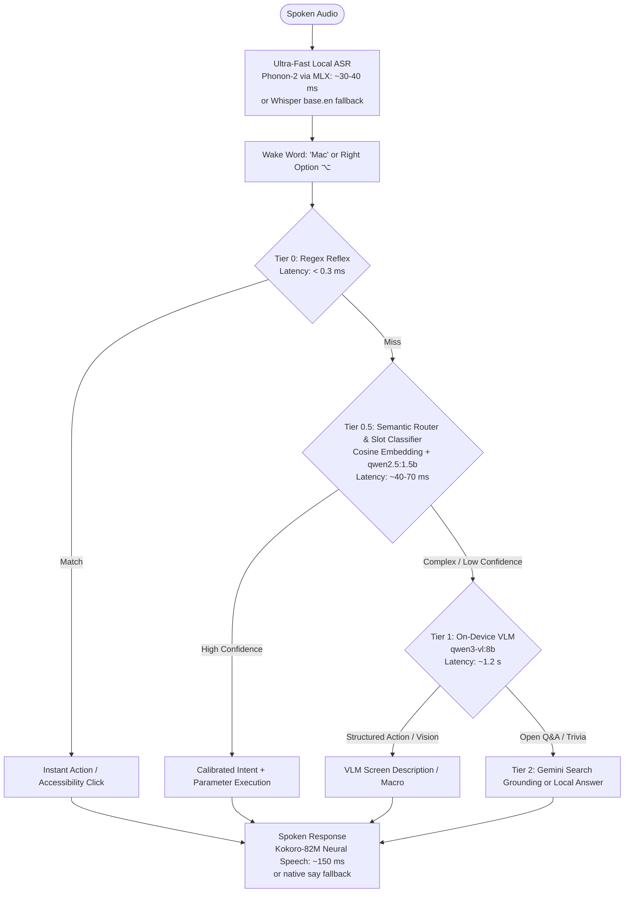
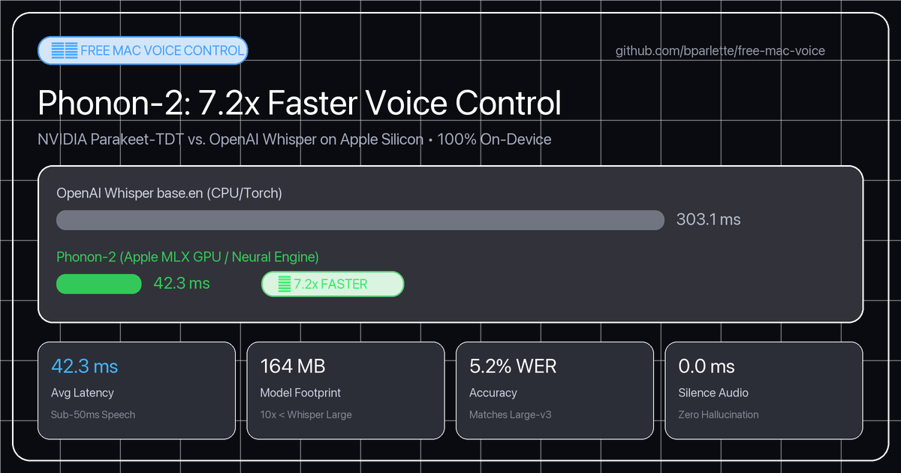

# 🎙️ Free Mac Voice Control

**Fast, private, 100% on-device voice control for macOS.**  
**$0 per command, forever.** No cloud subscriptions, no API keys required, no telemetry — every syllable is transcribed and executed locally on Apple Silicon.

[](https://apple.com)
[-orange.svg)](https://huggingface.co/FermionResearch/Phonon-2)
[-purple.svg)](docs/index.html)
[](https://developer.apple.com/metal/)
[-brightgreen.svg)](tests/)
[](#privacy--local-by-default)
[](benchmarks/README.md)
[](LICENSE)

> 📒 **Benchmarks:** every test we have run over weeks, what we changed because of it, and what we ruled out, is in the **[Benchmark Ledger](benchmarks/README.md)** ([summary on this page](#-benchmark-ledger-weeks-of-testing-in-one-place)).

---

## ⚡ The Experience

Hold **Right Option ⌥**, speak, release. Or simply talk hands-free using the wake word **"Mac"**:

> *"Mac, open notes and snap left"*  
> *"Mac, turn the TV volume down by 5"*  
> *"Mac, click the Reply button"*  
> *"Mac, what's on my screen?"*

---

## 🚀 One-Command Install

```bash
git clone https://github.com/bparlette/free-mac-voice.git
cd free-mac-voice

# Standard interactive setup:
bash install.sh

# Or 100% unattended / zero-touch setup (accepts defaults & enables login service):
bash install.sh --yes
```

The installer configures everything automatically: Homebrew packages, `whisper.cpp` with Metal acceleration, Python virtual environment, local AI decision and vision models, and opens a visual 60-second start guide (`welcome.html`).

---

## 🧠 The 4-Tier Architecture

Three faster tiers run before any generative model is called. Slower tiers only engage when faster tiers cannot resolve your request:



0. **ASR Front-End — Phonon-2 on Apple MLX (~30–40 ms):** Powered by Fermion Research's quantized 164 MB Parakeet-TDT model running natively on Apple Silicon MLX GPU/Neural Engine. Achieves a 5.2% WER matching Whisper Large at 7.2x faster speed with zero silence hallucinations.
1. **Tier 0 — The Reflex (<0.3 ms):** Exact pattern matching on compiled regex tables with fuzzy app resolution and conversational filler stripping. Native macOS Accessibility (`AXCloseButton`) directly closes application windows reliably without dropped keystrokes or confirmation prompts. Real UI clicks route through `xa11y` with an Apple Vision OCR fast-path (**~60 ms**).
2. **Tier 0.5 — Semantic Router & Intent Classifier (~40–70 ms):** Dual-stage semantic bridge. Stage (a) computes in-process cosine similarity against canonical intent embeddings (~2 ms, threshold 0.75). Stage (b) calls local `qwen2.5:1.5b` in JSON mode to classify intents and extract slots. Whisper/Phonon acoustic mishearings (*"john askey picture of a heart"*, *"call an ascii..."*) automatically route to actions without new regexes.
3. **Tier 1 — On-Device Vision-Language Model (~1.2 s):** Local `qwen3-vl:8b` handles visual screen understanding (*"what's on my screen"*, *"read my screen to me"*) and complex multi-entity phrasing. 100% private, offline, and resident in unified memory.
4. **Tier 2 — The Answerer (Optional):** Google's free Gemini API answers general trivia or open-ended web questions with live Google Search grounding. If offline or quota-limited, it falls back to the local model.
5. **Spoken Feedback — Kokoro-82M Neural TTS (~150 ms):** Natural, style-guided human speech with 8 curated personas (Fenrir, Heart, Adam, Sarah, etc.) running locally via ONNX Runtime with zero API calls. Seamlessly falls back to native macOS `say` if needed.

---

## 🗣️ Spoken Commands Reference

### 🚀 Apps, Windows & Spaces
| Voice Command | Action |
|---|---|
| `“open notes”` / `“open my code”` | Opens or focuses app (fuzzy matched to installed apps) |
| `“switch to safari”` / `“focus chrome”` | Prioritizes already-running applications |
| `“open notes and snap left”` | Chained command: opens app and tiles it left |
| `“snap left”` / `“snap right”` / `“maximize”` | Instant window layout and screen tiling |
| `“center window”` / `“minimize”` / `“close”` | Active window management |
| `“next space”` / `“prev space”` | Switches macOS virtual desktops (Spaces) |
| `“move to next display”` | Moves focused window to adjacent monitor |
| `“new tab”` / `“close tab”` / `“reopen tab”` | Browser / terminal tab management |
| `“show all windows”` / `“show desktop”` | Mission Control (F3) and Reveal Desktop (F11) |
| `“quit spotify”` / `“close all windows”` | Clean application shutdown (confirms aloud first) |

### 🍿 Apple TV & Couch Media Experience
| Voice Command | Action |
|---|---|
| `“watch youtube”` / `“open netflix”` | Launches streaming services directly in the browser |
| `“watch disney plus”` / `“open hulu”` / `“open max”` / `“watch prime video”` | Direct-to-app streaming launcher |
| `“watch apple tv”` | Opens native macOS Apple TV app (`/System/Applications/TV.app`) |
| `“search youtube for lofi hip hop”` | Direct search query on YouTube |
| `“skip 10 seconds”` / `“fast forward 30 seconds”` | Jumps forward across YouTube, Netflix, Disney+, VLC |
| `“rewind”` / `“go back 15 seconds”` | Jumps backward across video players |
| `“what did they say?”` | Rewinds 15s and toggles subtitles (signature Apple TV feature) |
| `“subtitles on”` / `“toggle subtitles”` | Toggles closed captions (`c` key standard across web players) |
| `“next episode”` | Plays next video or episode (`Shift+N`) |
| `“fullscreen”` / `“theater mode”` | Toggles macOS full screen (`Ctrl+Cmd+F`) |
| `“airplay”` / `“screen mirroring”` | Opens AirPlay Receiver settings to cast from iPhone or iPad |

### 🗣️ Voice Auditions & High-Definition Speech
*Powered by Kokoro-82M (default neural TTS engine) with instant offline `say` fallback.*
| Voice Command | Action |
|---|---|
| `“pick a voice”` / `“sample voices”` | Rotates through curated voices speaking: `"[Name]. This is what I sound like on your Mac."` |
| `“use voice Adam”` / `“set voice to Heart”` | Selects active voice (saved permanently to `~/.config/free-voice/config.json`) |
| `“switch voice to George”` / `“use voice Sarah”` | Switches persona and confirms in that exact voice |
| `“what is my voice?”` | Reports the currently active voice and TTS engine |

### 🔊 Sound, System & Media
| Voice Command | Action |
|---|---|
| `“set volume to 30”` / `“volume up”` / `“mute”` | System volume control |
| `“play”` / `“pause”` / `“next”` / `“previous”` | macOS media playback keys (Apple Music, Spotify, YouTube) |
| `“play some jazz”` | Launches matching playlist in Apple Music |
| `“dim screen”` / `“brightness up”` | Display brightness controls |
| `“turn wifi off”` / `“turn wifi on”` | Network controls |
| `“dark mode”` / `“light mode”` | Toggles macOS appearance |
| `“lock”` / `“lock it down”` | Instant screen lock |
| `“set a timer for 10 minutes”` | Background countdown, announces aloud on completion |
| `“are you working”` / `“status”` | Spoken health check: active mic, models, and errors |

### 📺 Samsung Smart TV Control (Over Wi-Fi)
*Requires one-time SmartThings token setup (see below).*
| Voice Command | Action |
|---|---|
| `“switch to computer”` / `“switch to tv”` | Switches TV input directly to your Mac or TV mode |
| `“switch input to HDMI 2”` | Switches TV to any named source |
| `“turn on the tv”` / `“turn off the tv”` | Powers the Samsung TV on or off |
| `“set tv volume to 25”` | Sets TV volume to exact level (0–100) |
| `“tv volume up”` / `“tv volume down by 5”` | Steps TV volume |
| `“mute tv”` / `“unmute tv”` | Mutes or unmutes Samsung TV audio |
| `“pause tv”` / `“play tv”` / `“stop tv”` | Controls Samsung TV media streaming playback |

### 👁️ Screen Vision & Smart Clicks
| Voice Command | Action |
|---|---|
| `“click the Reply button”` | Semantic click via Accessibility tree (`xa11y`) |
| `“click the blue Download link”` | High-speed Apple Vision OCR fast-path (**~60 ms**) |
| `“click”` | Clicks at current mouse coordinates |
| `“move mouse up 200”` / `“scroll down 3”` | Cursor positioning and smooth scrolling |
| `“what's on my screen”` | Quartz summary (~1.3 ms) or on-device VLM scene analysis |
| `“read my screen to me”` | Top-to-bottom window text readout |
| `“screenshot”` / `“record screen”` | Native macOS capture shortcuts |

### 🛠️ Dictation, Tools & Custom Shortcuts
| Voice Command | Action |
|---|---|
| `“when I say party mode, set volume to 80 and play some jazz”` | Teaches a new multi-command shortcut |
| `“when I say bedtime, turn off the tv and sleep”` | Teaches custom bedtime sequence |
| `“alias surf to open safari”` | Teaches new custom trigger words |
| `“when I say backup, run bash ~/backup.sh”` | Runs custom local shell scripts via voice |
| `“what are my shortcuts”` / `“list shortcuts”` | Reads your active custom shortcuts aloud |
| `“forget shortcut party mode”` | Deletes a custom shortcut |
| `“start dictating”` | Continuous dictation until you say `“stop dictating”` |
| `“read clipboard”` | Reads your copied clipboard text aloud |
| `“type today's date”` / `“type the time”` | Types formatted date/time stamp |
| `“turn my screen into ascii art”` | Converts screenshot to dark-mode HTML page in browser |
| `“draw a cat”` | Local LLM generates an SVG vector art file and opens it |
| `“tell me a joke”` / `“roll a die”` / `“flip a coin”` | Built-in conversational utilities |

### 🎮 3D Voice-Reactive Vector Runner (Zero-Interference Game Mode)
Free Mac Voice features a built-in 3D endless vector runner powered by WebGL (Three.js), sub-second local reflex routing, and generative world shifts:

| Voice Command | Action |
|---|---|
| `“Mac, start runner game”` / `“play runner game”` | Fires up Ollama, starts backend orchestrator, and launches 60 FPS WebGL game in Safari |
| `“left”` / `“right”` | Steers ship lane without saying "Mac" |
| `“jump”` | Hops over obstacles without saying "Mac" |
| `“faster”` / `“slower”` | Dynamic 2x turbo boost / 0.45x braking slow-motion |
| `“shoot”` | Fires twin laser cannons to shatter obstacles |
| `“change world to [theme]”` | Asynchronously hallucinates 3D palettes via local Qwen (e.g. *"change world to neon matrix"*) |
| `“Mac, close game”` / `“Hey Mac, quit game”` | Terminates runner orchestrator, closes Safari window, restores standard desktop voice control |
| `“Mac, <any macOS command>”` | Wake-word override: controls your Mac mid-game without interference (e.g. *"Mac, open notes"*) |

### 🤖 Rogue Mech Protocol — the Shooter Game (16-Bit Arcade)
A single-file 320×240 pixel-art cockpit game (`integrations/shooter_game/`) with three simultaneous loops: kill tanks and jets through the windshield, keep three reactor cores from staying red for 3 seconds, and beat the Stroop-effect weapons lock. Pick one of the 8 Sticker Kart pilots; your pilot turns to look back at the screen on every kill. Bundled sticker art in `assets/` (falls back to the Sticker Kart CDN, then to procedural pixel heads).

| Voice Command | Action |
|---|---|
| `“Mac, start shooter game”` / `“play shooter”` / `“play rogue mech protocol”` | Starts the voice bridge and opens the game in Safari (stops the runner if running; both share `ws://localhost:8765`) |
| `“Cap”`, `“Blaze”`, `“Hook”`, `“Sarge”`, `“Patch”`, `“Sumo”`, `“Zen”`, `“Marshal”` | Selects your pilot by name on the character select screen (or say `“pilot 1”` – `“pilot 8”`) |
| `“deploy”` / `“start”` / `“retry”` | Deploys your chosen pilot into mission or retries after Game Over |
| `“kick”` | Destroys the closest ground tank (big explosion + screen shake) |
| `“shoot”` / `“fire”` | Destroys the closest jet (needs unlocked weapons, else red error flash) |
| `“red”` / `“blue”` | Answer the **painted** color of the word, not the word itself. Right unlocks weapons for 3 s; wrong overheats a random core |
| `“vent one”` / `“vent two”` / `“vent three”` | Instantly cools reactor core 1 / 2 / 3 |
| `“Mac, close game”` | Shuts down the bridge and closes the window |

Keyboard fallback: `A`/`D` = red/blue, `K` kick, `S` shoot, `1`/`2`/`3` vent. Same Zero-Interference Game Mode as the runner: in-game words never trigger macOS actions; saying **"Mac"** hands control back instantly.

> [!NOTE]
> **Zero-Interference Game Mode**: While the runner is active, in-game speech (`left`, `jump`, `faster`, `shoot`, `change world...`) is captured exclusively by the game engine in `<1ms`. `free-mac-voice` will **never** trigger macOS accessibility clicks, window movements, or system actions on game words. Saying **"Mac"** or **"Hey Mac"** instantly handshakes back to macOS.

> [!TIP]
> **Update-Proof Customization**: All spoken shortcuts and custom extensions are saved directly to `~/.config/free-voice/` (outside the git repository). You can pull updates, run `bash upgrade.sh`, or reinstall anytime—your custom phrases, aliases, and shell macros are preserved forever. Developers can also drop custom Python handlers into `~/.config/free-voice/extensions.py` to add arbitrary code.

---

## 🎧 Listening Modes

### 1. Push-to-Talk (Default)
Hold **Right Option ⌥**, speak naturally, and release. Earcon audio confirms keypress and completion. Fast, zero-battery-drain, and perfect for noisy rooms.

### 2. Hands-Free Always-Listening (`--always`)
Run continuously with voice activity detection:
- **Wake Word:** Prepend commands with **"Mac"** (e.g. *"Mac, open Safari"*).
- **Two-Stage Wake Window:** Say *"Mac"*, hear the chime acknowledgment, and you have **15 seconds** (configurable with `VOICE_WAKE_WINDOW`) to speak your command without repeating the wake word.
- **Ambient Noise Rejection:** Room chatter, podcasts, and TV audio that do not trigger the wake word are ignored silently.
- **Double-Click Launcher:** Double-click `Voice Control (Always On).command` anytime.

### 3. Real-Time Streaming Whisper (`--stream`)
Powered by Metal-accelerated `whisper.cpp`:
```bash
python3 free_voice.py --stream
```
Streams audio chunks continuously. The instant a command completes (e.g. *"Mac, open notes"*), Tier 0 executes immediately mid-sentence without waiting for silence or speech-boundary timeouts.

### 4. Native Menu Bar Companion (`menu_bar.py`)
A lightweight status icon in your macOS menu bar reflects live state:
- 🎙️ **Listening** — mic open, waiting for wake word or hotkey
- 👂 **Wake Word Heard** — wake window active (15-second countdown)
- ⚙️ **Working** — executing action, OCR text locate, or model inference
- 💤 **Idle** — paused / standby

Start manually (`python3 menu_bar.py`) or let `install.sh` / `Voice Control (Always On).command` run it automatically.

### 5. Persistent Background Daemon (`service.sh`)
Run completely hands-free as a native macOS `LaunchAgent` without keeping a terminal open:
```bash
# Install and auto-start on macOS login:
./service.sh install

# Check status, PID, and health:
./service.sh status

# Manage lifecycle anytime:
./service.sh {start|stop|restart|logs|uninstall}
```
Supervises `free_voice.py --always` and the `menu_bar.py` status indicator with automated restart on failure.

---

## 🪄 Custom Shortcuts & Extensions (Update-Proof)

Teach your assistant new words, aliases, multi-step macros, or custom Python code that **never get erased or overwritten** when you update the software.

### 1. Teach New Words & Shortcuts by Voice (Zero Coding)
You can teach new phrases naturally without touching a terminal:

- **Create Multi-Action Sequences:**
  - *"Mac, when I say party mode, set volume to 80 and play some jazz"*
  - *"Mac, when I say bedtime, turn off the tv and sleep"*
- **Create Colloquial Aliases:**
  - *"Mac, alias surf to open safari"*
  - *"Mac, when I say chill out, turn down the volume"*
- **Run Local Shell Scripts / Terminal Commands:**
  - *"Mac, when I say backup, run bash ~/backup.sh"*
  - *"Mac, add shortcut clean temp runs rm -rf /tmp/scratch"*
- **Manage Shortcuts by Voice:**
  - *"Mac, what are my shortcuts?"* — Reads all active custom shortcuts aloud
  - *"Mac, forget shortcut party mode"* — Deletes a shortcut

*Saved directly to `~/.config/free-voice/macros.json` — completely outside the git repository.*

### 2. Custom Python Extensions (`extensions.py`)
For power users and developers who want custom Python code, API integrations, or hardware hooks:

1. Drop a script into `~/.config/free-voice/extensions.py` (a starter template is auto-generated at `~/.config/free-voice/extensions.py.example`).
2. Define a `register(add_command)` hook:

```python
# ~/.config/free-voice/extensions.py
# Survives all updates, git pulls, and reinstalls.

def register(add_command):
    def handle_brew_update(match):
        import subprocess
        subprocess.Popen(["brew", "update"])
        print("Homebrew update running!")

    # add_command(regex_pattern, handler_function, partial_ok=False)
    add_command(r"^update homebrew$", handle_brew_update)
```

Whenever the voice engine starts or reloads, it automatically discovers and binds your custom extensions without modifying core code.

---

## 🗣️ High-Definition Neural Voice (Kokoro-82M Default)

`free-mac-voice` defaults to **Kokoro-82M** for spoken feedback, giving you **ElevenLabs-tier natural human speech** running 100% locally on your Mac with zero cloud fees, zero subscriptions, and zero API keys:

- **Audition Voices by Voice:** Say *"Mac, pick a voice"* (or *"sample voices"* / *"choose a voice"*). The assistant rotates through curated personas speaking:
  > *"[Name]. This is what I sound like on your Mac."*
- **Choose Your Voice:** Say *"Mac, use voice Heart"* or *"Mac, set voice to Adam"*. The assistant confirms your choice in that exact voice (default: **Fenrir**, second recommended: **Heart**).
- **Update-Proof Persistence:** Your selected voice is saved directly to `~/.config/free-voice/config.json`, surviving software updates and reinstalls.
- **Instant Fallback:** If offline, running in a minimal container, or if model files are uninitialized, it falls back seamlessly to macOS native `say` without interruption.

#### 🎧 Voice Audition Showcase

> [!NOTE]
> **Why does GitHub say "Preview unavailable"?**  
> GitHub's repository code viewer does not embed an audio player for raw `.wav` or `.mp3` files (showing a *"Preview unavailable"* placeholder).  
> - **🌐 Web Audio Player:** Visit the **[Interactive Web Audio Showcase](https://bparlette.github.io/free-mac-voice/)** to play, pause, and compare all voices with waveforms in your browser.  
> - **▶️ Direct Stream:** Click any of the **[▶️ Stream MP3]** or **[▶️ Stream WAV]** links in the table below (bypasses GitHub's code viewer directly to the audio stream).  
> - **🎙️ Audition on Your Mac:** Say *"Mac, pick a voice"* hands-free, or test locally in terminal: `afplay docs/audio_samples/fenrir_sample.wav`

| Voice | Style & Accent | Sample Quote | Direct Audio Stream |
|:---|:---|:---|:---:|
| **Fenrir** *(Default)* | Cinematic American Male | *"Fenrir. This is what I sound like on your Mac."* | [▶️ Stream MP3](docs/audio_samples/fenrir_sample.mp3?raw=true) · [WAV](docs/audio_samples/fenrir_sample.wav?raw=true) |
| **Heart** *(Recommended)* | Warm & Expressive American Female | *"Heart. This is what I sound like on your Mac."* | [▶️ Stream MP3](docs/audio_samples/heart_sample.mp3?raw=true) · [WAV](docs/audio_samples/heart_sample.wav?raw=true) |
| **Adam** | Deep & Resonant American Male | *"Adam. This is what I sound like on your Mac."* | [▶️ Stream MP3](docs/audio_samples/adam_sample.mp3?raw=true) · [WAV](docs/audio_samples/adam_sample.wav?raw=true) |
| **Sarah** | Clear & Sharp American Female | *"Sarah. This is what I sound like on your Mac."* | [▶️ Stream MP3](docs/audio_samples/sarah_sample.mp3?raw=true) · [WAV](docs/audio_samples/sarah_sample.wav?raw=true) |
| **Nicole** | Upbeat & Friendly American Female | *"Nicole. This is what I sound like on your Mac."* | [▶️ Stream MP3](docs/audio_samples/nicole_sample.mp3?raw=true) · [WAV](docs/audio_samples/nicole_sample.wav?raw=true) |
| **George** | Refined British Male | *"George. This is what I sound like on your Mac."* | [▶️ Stream MP3](docs/audio_samples/george_sample.mp3?raw=true) · [WAV](docs/audio_samples/george_sample.wav?raw=true) |
| **Emma** | Crisp & Articulate British Female | *"Emma. This is what I sound like on your Mac."* | [▶️ Stream MP3](docs/audio_samples/emma_sample.mp3?raw=true) · [WAV](docs/audio_samples/emma_sample.wav?raw=true) |
| **Michael** | Dynamic American Male | *"Michael. This is what I sound like on your Mac."* | [▶️ Stream MP3](docs/audio_samples/michael_sample.mp3?raw=true) · [WAV](docs/audio_samples/michael_sample.wav?raw=true) |

---

## 🏎️ The Benchmark: Phonon-2 (Apple MLX) vs. OpenAI Whisper

<p align="center">
  <a href="https://bparlette.github.io/free-mac-voice/benchmark.html">
    
  </a>
</p>

> *"How we made local Mac voice commands 7.2x faster with zero cloud lag, zero silence hallucinations, and a tiny 164 MB footprint."*  
> 🔗 **Shareable Benchmark Link:** [Interactive Benchmark Card](https://bparlette.github.io/free-mac-voice/benchmark.html) · [Direct High-Res Image](https://raw.githubusercontent.com/bparlette/free-mac-voice/main/docs/assets/benchmark_card.png)
>
> 📒 **Every other benchmark we have run, what we changed because of it, and what we ruled out:** see the [Benchmark Ledger](#-benchmark-ledger-weeks-of-testing-in-one-place) below and [`benchmarks/README.md`](benchmarks/README.md).

We benchmarked **OpenAI Whisper `base.en`** against **Phonon-2 (Parakeet-TDT)** head-to-head on Apple Silicon unified memory using real macOS speech across representative desktop voice commands:

### ⚡ Side-by-Side Command Latency

| Voice Command | Spoken Audio Duration | OpenAI Whisper `base.en` (CPU/Torch) | Phonon-2 (Apple MLX Metal) | Real-World Speedup | Accuracy & Behavior |
|:---|:---:|:---:|:---:|:---:|:---|
| **`"Mac close window"`** | 1.11 s | 367.8 ms | **77.5 ms** | **4.7x faster** 🚀 | 100% exact transcription |
| **`"draw an ascii picture of a heart"`** | 1.76 s | 311.8 ms | **34.7 ms** | **9.0x faster** ⚡ | Fast phonetic transcription, matches Tier 0.5 |
| **`"switch to TV"`** | 1.02 s | 264.1 ms | **25.8 ms** | **10.2x faster** ⚡ | 100% exact transcription |
| **`"could you please open notes for me"`** | 1.86 s | 307.8 ms | **32.6 ms** | **9.4x faster** ⚡ | 100% exact transcription |
| **`"type password123"`** | 1.96 s | 264.1 ms | **40.9 ms** | **6.5x faster** 🚀 | Clean number/word recognition |
| **Average End-to-End Latency** | — | **303.1 ms** | **42.3 ms** | **7.2x faster** | **Zero hallucinations on silence** |

---

### 🔍 Why Phonon-2 Crushes Traditional Whisper on macOS

1. **Non-Autoregressive Transducer (TDT vs. Encoder-Decoder):**  
   Whisper is an autoregressive sequence-to-sequence model that generates text token-by-token. In contrast, Phonon-2 is based on NVIDIA's **Parakeet Token-and-Duration Transducer (TDT)**, predicting tokens and frame durations simultaneously in parallel.
2. **Zero Silence Hallucination:**  
   Whisper often hallucinates phantom words or infinite repetition loops when listening to microphone background noise or room silence. Phonon-2 emits tokens only when speech phonemes exist—transcribing 1.0s of silence takes **0.0 ms** and outputs an exact empty string `""`.
3. **164 MB Footprint with Large-v3 Quality:**  
   Through advanced ternary/2.1-bit quantization, Phonon-2 requires only a **164 MB download**, yet achieves an average **5.2% Word Error Rate (WER)** across standard English benchmarks—matching OpenAI's 1.5 GB Whisper Large-v3 (a model 10x its size).
4. **Native Apple Silicon MLX GPU/Neural Acceleration:**  
   Executes directly on unified memory via Apple's MLX engine (`mlx` + Metal shaders), completely eliminating PyTorch/CPU bus bottlenecks.
5. **Pluggable & Graceful Fallback:**  
   Configurable via `VOICE_STT_ENGINE=phonon` (default on Apple Silicon) with transparent fallback to Whisper if running on non-Apple-Silicon systems or minimal containers.

---

## 📒 Benchmark Ledger: weeks of testing, in one place

We benchmark everything before changing the assistant, and write down what we tried, what we changed, and what we ruled out, including the
dead ends. This section is **generated from [`benchmarks/README.md`](benchmarks/README.md)** (the full ledger, with the saved raw results next to each
benchmark in `benchmarks/*/results/`); run `python benchmarks/update_ledger.py` after adding results and it refreshes both. Test sets are synthetic and
numbers are only comparable inside one test set; see the ledger for the caveats.

### What changed in the assistant because of the benchmarks

<!-- AUTO:ledger-live:START -->
| Change | Date | Why |
|---|---|---|
| Tier 0.5a embeddings run **in-process with ONNX** by default (`TIER05_EMBED_BACKEND`, falls back to Ollama if the model is missing) | 2026-10-07 | Same accuracy as the Ollama copy at about 6 ms and 0.1 GB instead of 10-16 ms and about 650 MB |
| Tier 0.5a threshold 0.82 | 2026-10-06 | Better recall and fewer false accepts than 0.78 on the then-current test |
| Speaker verification removed | 2026-10-08 | Wake word makes it unnecessary for this setup (the model was only a weak second filter) |
| App-name lookup handles polite phrasing ("can you launch chrome please") | 2026-10-08 | Tier 0.5a matched the intent but dropped it for lack of an app name |
| Ollama upgraded 0.35 -> 0.40 | 2026-10-07 | Identical accuracy; embeddings through Ollama faster; command-gate endpoint compatible |

**Supported by the data but not applied yet** (needs an owner decision): disable Tier 0.5b (`OLLAMA_DECISION_MODEL=` empty), tighten the Tier 0 regex, and
skip the pre-filled answer start for non-thinking models so a 4B/8B *instruct* model can be used. See [recommendations](benchmarks/README.md#recommendations).
<!-- AUTO:ledger-live:END -->

### Where things stand

<!-- AUTO:ledger-standings:START -->
### A. Tier 0.5a embedding tier and small routers (held-out half of the intent set: 204 commands / 200 non-commands)

| Approach | Correct command | Non-commands acted on | Size / speed |
|---|---|---|---|
| Router as it was deployed (examples included 75 test phrases: inflated) | 73.5% | 17.0% | n/a |
| **Router, leak-free** (Ollama EmbeddingGemma v1, threshold 0.82, regex tier first) | **61.8%** | **16.0%** | about 650 MB in Ollama; 10 ms |
| **ONNX q4 EmbeddingGemma v1, in-process (now the default)** | 62.3% (63.2% with Google's task prefix) | at the same 16% | **+0.1 GB; 6 ms** |
| EmbeddingGemma 2 (Ollama 270m / ONNX q4) | 54.9% / 57.8% | at the same 16% | 330 MB / +0.25 GB: worse, not adopted |
| Fine-tuned Qwen2.5-0.5B, trained on the router's own examples + hand-written negatives | 65.7% (conf >= 0.8) | 9.5% | +0.4 GB; 45 ms |
| Same, trained on about 2.4x as much in-distribution data | **81.4%** (conf >= 0.7) | **5.0%** | same: data is the lever |
| Laya decision model, zero-shot | 52.0% | 63.5% | 2.7 GB; 325 ms: dropped |

### B. The local LLM (Tier 1 routing, screen questions, answers): Qwen3-VL and Qwen3.5 sizes

Same 60 commands / 60 non-commands (held-out), 12 screen questions, 10 general questions, using the assistant's own functions. "Routing, current code" uses
the assistant's JSON-output request, which Ollama 0.40 refuses for Qwen3.5 (so those rows show 0). Routing without the code's pre-filled answer start, and the
other routers, are in the notes below the table.

| Model | Resident | Speed | Routing, assistant's current code (of commands) | Non-commands acted on | Screen questions | General questions |
|---|---|---|---|---|---|---|
| `qwen3-vl:8b` | 5.17 GB | 16.3 tok/s | 52/60 right, 3 no answer (1.39 s) | 9/60 | 12/12 (9.3 s) | 8/10 (12.1 s, 1 silent) |
| `qwen3-vl:8b-instruct` | 5.17 GB | 15.8 tok/s | 47/60 right, 9 no answer (1.41 s) | 7/60 | 12/12 (4.9 s) | 9/10 (0.5 s) |
| `qwen3-vl:4b-instruct` | 3.02 GB | 27.4 tok/s | 9/60 right, 50 no answer (0.17 s) | 0/60 | 12/12 (4.1 s) | 9/10 (0.3 s) |
| `qwen3-vl:4b` | 3.02 GB | 29.6 tok/s | 9/60 right, 48 no answer (0.17 s) | 1/60 | 11/12 (5.6 s) | 7/10 (8.0 s, 3 silent) |
| `qwen3-vl:2b-instruct` | 1.64 GB | 53.7 tok/s | 12/60 right, 47 no answer (0.1 s) | 1/60 | 12/12 (1.5 s) | 9/10 (0.1 s) |
| `qwen3.5:2b` | 3.0 GB | 32.8 tok/s | 0/60 right, 60 no answer (0.0 s) | 0/60 | 12/12 (2.8 s) | 8/10 (0.5 s) |
| `qwen3.5:0.8b` | 1.29 GB | 68.7 tok/s | 0/60 right, 60 no answer (0.0 s) | 0/60 | 10/12 (1.4 s) | 7/10 (0.1 s) |

Notes (from `model_size_eval/README.md`):
- The default tags `qwen3-vl:8b` / `:4b` are **thinking** builds: general answers take about 12 s on the 8B and the answer can come back **empty** (the model spends its
  token budget reasoning). **Instruct** builds answer in 0.3-0.5 s.
- With the pre-fill skipped, **4B instruct routes 51/60 (15 false accepts)**; the same pre-fill that helps thinking models collapses it to 9/60.
- The 8B instruct's routing without the pre-fill, and a harder screen/question set, were **not run**.
- Cold start (model unloaded): 8B 6.6 s, 4B instruct 9.6 s.
- Qwen3.5 0.8B / 2B without `format=json`: routing 35 / 45 of 60 (with 20 / 11-15 false accepts).

### C. The whole pipeline, end to end (dry-run on real code; 80 commands + 80 adversarial non-commands)

In the real pipeline the command gate only guards the **wake window** (follow-up speech) and only for phrases the regex tier does not match.

| | Current pipeline | Tier 0.5b disabled |
|---|---|---|
| After wake word: commands routed to an acceptable action | 53/80 | 55/80 |
| Wake window: commands correct | 37/80 | 39/80 |
| Wake window: wrong action | 20 | 17 |
| **Wake window: non-commands wrongly acted on** | **33/80** | **22/80** |
| ...by tier | {"Tier 0.5b": 12, "Tier 0.5a": 6, "Tier 0": 12, "Tier 1": 3} | {"Tier 0.5a": 6, "Tier 0": 12, "Tier 1": 4} |

### D. Voice output (TTS): Kokoro vs Paradee (`tts_eval/`)

| | Speed | Short phrase | Process memory | Word error (Whisper round trip) |
|---|---|---|---|---|
| Kokoro (the assistant's voice) | 4.3x real time | 450 ms | 0.66 GB | 4.7% |
| Paradee int8 (one female voice) | 17.7x | 131 ms | 0.54 GB (its phonemizer takes 0.37 GB) | 3.5% |

Not adopted: memory barely improves, the voice changes, and it needs Python 3.12 (spaCy has no build for 3.14). Subjective quality was not judged.

### E. Other measurements (not in a results folder)

- Display refresh 120 Hz -> 60 Hz on the TV: macOS compositor CPU 43.8% -> 41.3%, so refresh rate was not the main cost (the display runs a 4K-backed mode; idle load stayed near 38%).
- Ollama 0.35 -> 0.40: embeddings 16 -> 10 ms, generation speed unchanged (61 tok/s on qwen2.5:1.5b); the 0.40 server re-saved every model in a new format and **kept the old copies** (store grew 8.9 -> 35 GB until test downloads were removed).
<!-- AUTO:ledger-standings:END -->

<details>
<summary><b>Timeline: everything we tried, with dates</b></summary>

<!-- AUTO:ledger-timeline:START -->
| Date | What | Result | Where |
|---|---|---|---|
| 2026-10-03 | Router bake-off: qwen2.5:1.5b vs decision models (Kev-4B, lev, tev1:0.8b, Julia-1, Laya); 8-option and 40-option tests | Kev-4B best: 81.6% accuracy, 9.2% false triggers, 0.66 s, 4.7 GB. tev1:0.8b 70.2% / 35.9% (max 26 options). qwen2.5:1.5b 67.8% / 43.3%. Laya, Julia-1 too cautious as routers; fine as yes/no gates | `docs/router-benchmark.md` |
| 2026-10-06 | Embedding bake-off: n-gram hash vs nomic-embed-text vs EmbeddingGemma v1 vs v2 (small hand-written set) | EmbeddingGemma v1 chosen | `embed_bakeoff/` |
| 2026-10-06 | Intent-eval harness (800 phrases); examples expanded; threshold 0.78 -> 0.82 | Reported 77.5% recall / 6.5% false accepts. **Later corrected**: it counted any match, and 75 test phrases were in the examples | `intent_eval/` |
| 2026-10-06 | Speaker ID: legacy model (same-speaker 0.26 vs other 0.0) -> WeSpeaker CAM++ (0.48 vs 0.03) | Better margin; feature **removed 2026-10-08** | (history) |
| 2026-10-07 | Fine-tune bake-off: router vs fine-tuned Qwen 0.5B (MLX LoRA) vs Laya zero-shot vs EmbeddingGemma 2 | Fair router baseline 61.8% / 16%; fine-tune beats it (65.7% / 9.5%, or 81.4% / 5.0% with more data); Laya dropped. Three failed first attempts documented (eval bug, divergence, collapse) | `finetune_eval/` |
| 2026-10-07 | ONNX vs Ollama embeddings; Ollama 0.35 vs 0.40; ONNX variants and CoreML | ONNX q4 matches accuracy at 6 ms / 0.1 GB: **made the default**. CoreML provider broken. Int8 slow | `finetune_eval/results/` |
| 2026-10-07 | TTS: Kokoro vs Paradee | Faster, equally intelligible, not worth switching | `tts_eval/` |
| 2026-10-08 | Qwen3-VL 8B (thinking) vs 4B (thinking) vs 4B / 8B instruct | Thinking builds are slow and sometimes silent; instruct builds fix it; 4B instruct routes like the 8B once the pre-fill is skipped | `model_size_eval/` |
| 2026-10-08 | End-to-end pipeline dry-run, with and without Tier 0.5b | 33 -> 22 of 80 false triggers without 0.5b | `pipeline_eval/` |
| 2026-10-08 | `tev1:0.8b` as action router (embedding shortlist + decision model) | Worse than embeddings alone; the API takes 2-26 options | `model_size_eval/` |
| 2026-10-08 | Qwen3.5 0.8B / 2B and qwen3-vl 2B instruct | 2B instruct: 1.6 GB, 12/12 screen questions in 1.5 s, weak router. Qwen3.5 refused by Ollama's JSON mode | `model_size_eval/` |
<!-- AUTO:ledger-timeline:END -->

</details>

<details>
<summary><b>Tried and dropped, or ruled out without running</b></summary>

<!-- AUTO:ledger-dropped:START -->
| Item | Why |
|---|---|
| Laya (zero-shot), `laya-mlx` | Weak as a router (52% / 63.5% false accepts) and 2.7 GB; the MLX build is a one-person conversion |
| EmbeddingGemma 2 (Ollama, ONNX), ONNX int8, ONNX on the CoreML provider | Less accurate than v1, slow, or broken |
| Paradee TTS | See section D |
| Unsloth Studio install, Unsloth decision-model fine-tuning | System-level install with no clear Apple-silicon training path; MLX LoRA used instead |
| OpenAI Decisions API (cloud) | Would send speech text off the device |
| Qwen3.8-27B variants (DFlash2, ANEMLL Neural Engine package, abliterated build), Underdog Saluki 27B | Too large for 16 GB next to the rest, mostly NVIDIA-only, or unsafe |
| Cloudflare Clef-flash 9B, Nimble 9B | Need roughly 41 GB of memory or more |
| Gemma 4 E2B | 7 GB download despite the name |
<!-- AUTO:ledger-dropped:END -->

</details>

<details>
<summary><b>What we will benchmark next (priority order)</b></summary>

<!-- AUTO:ledger-backlog:START -->
1. Apply and re-verify recommendation 1 (disable Tier 0.5b) in the live assistant; then tighten the regex tier.
2. Full pipeline with 4B instruct and 8B instruct as Tier 1 (needs the pre-fill skipped for instruct models).
3. Harder screens and reasoning questions for the 2B / 4B (the current ones are easy).
4. 8B instruct without the pre-fill (6 GB download).
5. New decision models: Liquid d1-omni-600M and d1-3B (released 2026-10-07; needs a runtime that serves `/v1/systemone`, which the installed llama.cpp lacks), Amazon Strands Decider 2B (2026-10-01), `tev1:4b`, and a re-test of Kev-4B end to end.
6. Real-audio false-wake test (hours of TV and podcasts) and the wake-word false-wake rate.
7. TTS listening test and time to first spoken word on long replies.
8. Compositor load at true idle: plain 1080p vs 4K-backed mode, wallpaper, Safari content.
9. Live ONNX-vs-Ollama comparison on real speech (`TIER05_EMBED_BACKEND=compare`, then grep the log).
10. Fine-tune a decision head on the assistant's own labeled utterances (data was the biggest lever).
<!-- AUTO:ledger-backlog:END -->

</details>

---

## 📊 End-to-End Latency by Tier

Measured on Apple Silicon unified memory:

| Tier | Routing Path | Median Latency (\(p50\)) | Mechanism |
|---|---|---|---|
| **ASR** | **Phonon-2 Speech-to-Text** | **25 ms – 42 ms** | **Apple MLX Parakeet-TDT (164 MB)** |
| **Tier 0** | Regex Reflex | **0.3 ms** | In-memory compiled regex table |
| **Tier 0** | Native Window Close | **2.1 ms** | macOS Accessibility `AXCloseButton` |
| **Tier 0** | Apple Vision OCR (Cached) | **60.1 ms** | Native macOS `VNRecognizeTextRequest` |
| **Tier 0.5** | **Semantic Intent Match** | **2.2 ms** | In-process cosine embedding similarity ($cos > 0.75$) |
| **Tier 0.5** | **Decision Model Slot Extract** | **42 ms – 68 ms** | Local `qwen2.5:1.5b` JSON mode classification |
| **Tier 1** | Local VLM (`qwen3-vl:8b`) | **1.26 s** | Autoregressive JSON decoding (`num_ctx=1024`) |
| **Tier 1** | Fast SVG Generation (`qwen2.5:1.5b`) | **1.82 s** | Lightweight text model generation |
| **Tier 2** | Gemini Free-Tier Grounding | **2.10 s** | Cloud Search + generative answer |

---

## 🔒 Privacy & Local by Default

- **Zero Audio Uploads:** Audio never leaves your Mac. Whisper and Ollama run 100% on your local GPU.
- **No Analytics / Telemetry:** No tracking, no user profiling, no phone-home pings.
- **Optional Cloud Expansion:** If you choose to add a free Gemini API key to `~/.free-voice/.env` for world trivia, web searches route through Google's free tier. If unset, the system runs completely offline.

---

## 📺 Samsung TV Setup (Optional)

Control Samsung Smart TV power, inputs, volume, and playback over Wi-Fi:

1. **SmartThings app:** Add your Samsung TV in the mobile SmartThings app on your Wi-Fi.
2. **Personal Access Token:** Go to [account.smartthings.com](https://account.smartthings.com) → *Personal Access Tokens* → Generate token with `r:devices:*` and `x:devices:*` scopes.
3. **Configure Environment:** Add to `~/.free-voice/.env`:
   ```bash
   SAMSUNG_ST_TOKEN=your-token-here
   SAMSUNG_TV_DEVICE_ID=your-tv-device-id
   ```
4. **Discover:** Run `python3 samsung_tv.py discover` to list devices and confirm input port aliases.

---

## 🧪 Bulletproof Testing

The test suite stubs all hardware (no mic, TV, or live Ollama instance required) for instant verification:

```bash
# Run all 213 hermetic unit tests (completes in < 1 second):
python3 -m unittest discover -s tests

# Run performance benchmarks:
python3 benchmarks/bench.py --quick
```

---

## 💻 Requirements

- **Apple Silicon Mac:** M1, M2, M3, or M4 (8 GB RAM minimum; 16 GB recommended for `qwen3-vl:8b`).
- **Microphone:** Built-in MacBook mic, USB mic, or iPhone Continuity microphone (Mac mini has no internal mic).
- **macOS Permissions:** Microphone, Accessibility, Input Monitoring (+ Screen Recording for UI button locator). The installer guides you through native prompts in ~60 seconds.

---

## 📄 License

MIT License — free for personal and commercial use.
